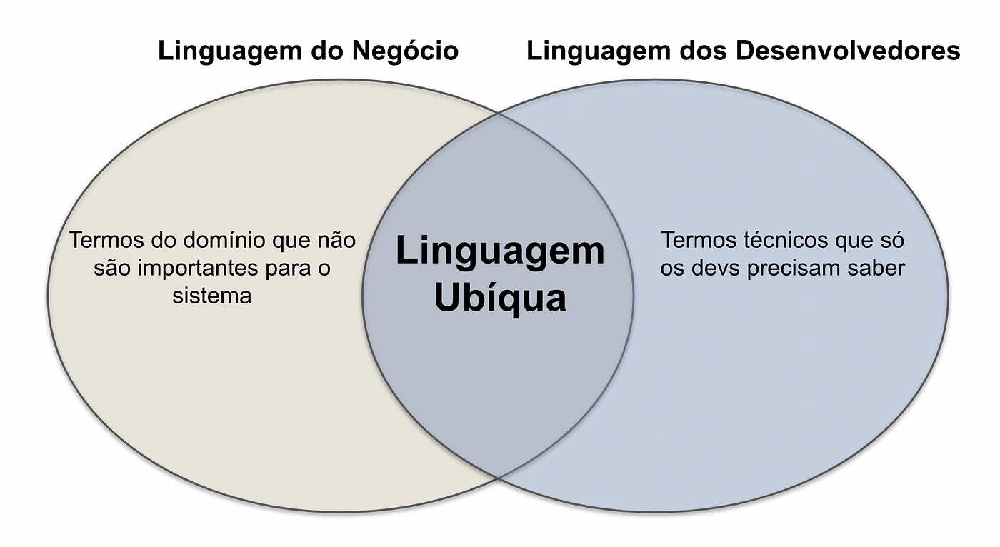
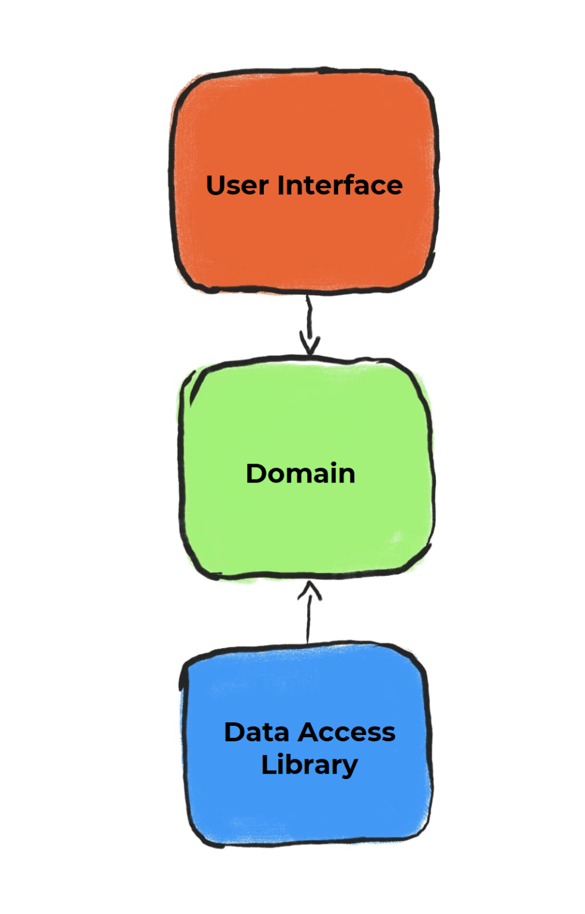
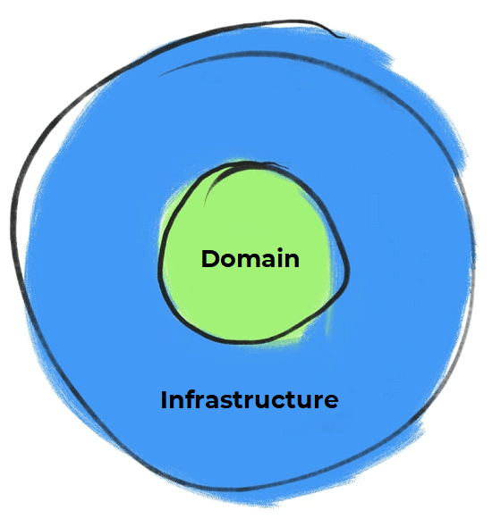
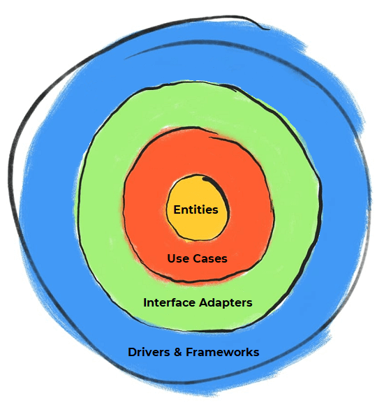

# Como tudo começou?

Durante uma conversa com seu filho, Micah Martin, que também é um desenvolvedor de software, estava mostrando a Robert a estrutura de diretórios do projeto que estava atuando.

Ao analisar aquela estrutura de alto nível da arquitetura, sem maiores esforços, conseguiu identificar que a tecnologia utilizada era Ruby on Rails, ou seja, sem a necessidade de aprofundar na arquitetura do projeto. Para Uncle Bob ficava nítido qual tecnologia aplicada, e isso o incomodou muito, dando início a criação da Arquitetura Limpa ou Clean Architecture.

Clean Architecture foi primeiramente apresentada em seu blog em 2012, o The Clean Code Blog, onde Micah Martin também é coautor de muitos tópicos, posteriormente no ano de 2017 a arquitetura foi promovida no livro Clean Architecture: A Craftsman’s Guide to Software Structure.

## Mas o que é o Clean Architecture?
Clean Architecture é uma arquitetura de software proposta por Robert Cecil Martin (ou Uncle Bob, como é mais conhecido) que tem por objetivo padronizar e organizar o código desenvolvido, favorecer a sua reusabilidade, assim como independência de tecnologia.

Por mais que a Clean Architecture foi criada em meados de 2012, está repleta de princípios atemporais que podem ser aplicados independente da tecnologia utilizada e linguagem de programação.

## Domain-Centric Architectures: arquiteturas centrada no domínio
Devo enfatizar que ao estudarmos a Clean Architecture, em algum momento vamos nos deparar com alguma outra arquitetura de design similar, que visa isolar o core da aplicação do mundo externo através do uso de camadas, um princípio conhecido como Separação de Responsabilidades (Separation of Concerns – SoC). Vamos ver algumas dessas arquiteturas a seguir:

Vamos começar pela Hexagonal Architecture, também conhecida como Ports and Adapters, criada pelo Alistair Cockburn. Devido a sua semelhança e por também se tratar de uma arquitetura Domain-Centric (sendo que este tipo de arquitetura entende que o domínio é a razão pela qual o software existe, colocando ele no centro) acaba confundindo profissionais de desenvolvimento que acham que a Hexagonal Architecture e a Clean Architecture são a mesma coisa. 

No mesmo cerne, Jeffrey Palermo criou outra importante arquitetura, a Onion Architecture. 

Ao analisarmos as arquiteturas citadas, vamos perceber que além de colocar o domínio no centro da arquitetura, existem outros pontos em comum entre as três. Ouso dizer que ao atuarmos em um projeto que se utiliza de uma delas, poderemos inicialmente ter dificuldade para identificar qual das três arquiteturas de software se trata, devido a pequena variação nos detalhes dos padrões adotados e acima de tudo terem em comum, o objetivo de separar as preocupações do software, impondo uma disciplina de como devemos codificar, dividindo em um diagrama de camadas, de forma que cada um dos seus componentes possui suas próprias responsabilidades e cada uma delas tem conhecimento apenas de camadas de dentro.

## Entenda a infraestrutura por trás da Arquitetura Limpa 
Na imagem abaixo, temos a representação de uma arquitetura em camadas (Layered Architecture) tradicional, onde as setas esboçam a direção das dependências seguindo um fluxo do topo para baixo. 

Assim, a interface do usuário depende da camada de domínio, que por sua vez depende da camada de acesso ao banco de dados. 

Com isso podemos observar que existe um acoplamento forte entre as camadas, de forma que, para substituir a camada de banco de dados precisamos alterar a camada de domínio.

Robert “Uncle Bob” Martin, se refere fortemente à organização do projeto visando o fácil entendimento e que seja ágil a mudanças, conforme as necessidades encontradas no amadurecimento do software. Para assim termos a capacidade de desenvolver encapsulando toda a lógica de negócios, de forma intrinsecamente testável, independentemente do restante da infraestrutura.

Conforme Mark Seeman, as abstrações não devem depender de detalhes, e sim os detalhes devem depender de abstrações. Com isso, nesta segunda imagem, o fluxo de dependência entre as camadas, centraliza a camada de domínio, com uma simples alteração na direção da seta que liga a camada de domínio com a de acesso ao banco de dados.

Na ilustração vemos três caixas ligadas por setas. A primeira caixa é vermelha e está escrito "User interface" ela é ligada a segunda que é verde e diz "Domain”. Já a última é azul e diz "Data Access Library" e ela se conecta com a segunda. 
Como podemos ver, uma vantagem da Clean Architecture em comparação com as arquiteturas tradicionais de três camadas, se dá pelo fato de poder definir estes componentes de infraestrutura em um momento posterior, assim como removê-los ou substituí-los com uma complexidade reduzida. 

Em outras palavras, podemos projetar aplicativos com menor acoplamento e independentes de detalhes técnicos de implementação, como bancos de dados e estruturas.

## Clean Architecture: muito mais do que camadas
Dentre as principais regras do Clean Architecture, devemos ter maior atenção ao fato que podemos mover as dependências apenas dos níveis externos para os internos, conforme as setas apresentadas na clássica imagem abaixo.

Com isso, os códigos nas camadas internas não precisam ter conhecimento necessariamente das funções nas camadas externas. Os níveis mais internos não podem mencionar as variáveis, funções e classes que existem nas camadas externas.

## Mas afinal por que separar em camadas? 
Partindo do princípio de que esta regra de dependência está sendo bem aplicada, esta separação de camadas visa nos poupar de problemas futuros com a manutenção do software. Deixando, inclusive, o sistema completamente testável, pois as regras de negócios podem ser validadas sem a necessidade da interface do usuário, banco de dados, servidor ou qualquer outro elemento externo. 

Outro ponto de extrema relevância, por ser uma arquitetura de software amplamente independente, é que a princípio conseguimos fazer a substituição da interface do usuário sem que isso reflita no resto do sistema. 

Assim como podemos trocar o banco de dados, por exemplo, de Oracle ou SQL Server, por Mongo, DynamoDB ou qualquer outro, pois suas regras de negócios não estão vinculadas ao banco de dados, nos facilitando a troca destes componentes caso tenham se tornado obsoletos ou por qualquer outra necessidade de negócio/técnica sem encontrar maiores dificuldades.

## Architecture: Domínio e Infraestrutura

Para facilitar o nosso entendimento, vamos reduzir o escopo do desenho apresentado pelo Uncle Bob em seu blog. Assim, isolamos o nosso entendimento sobre cada parte da arquitetura, dividindo em duas camadas de alto nível, separando a camada de domínio contendo toda a lógica de negócio, da nossa camada de infraestrutura, contendo as tecnologias utilizadas no projeto.

Como podemos ver na imagem acima, o núcleo deve ser responsável pela razão do software existir, ou seja, o domínio entrega a identidade do seu aplicativo. Através da lógica central do negócio contida nele, devido a sua importância, alterações nesta camada, faz com que provavelmente modifique a essência do software.

Como podemos perceber, a ideia principal neste tipo de arquitetura é proteger o domínio, tornando inclusive mais simples a troca de algum componente de infraestrutura caso se torne necessário. Afinal, a responsabilidade de como seu software se comunica com o mundo externo, fica para a camada de infraestrutura, que com base na especificidade do software, abre a comunicação a humanos, através de uma interface visual, por exemplo, ou comunicação a um banco de dados, filas e até mesmo integração com outras APIs.

## Aprofundando nosso conhecimento nas camadas da Arquitetura Limpa]

Agora que conhecemos a divisão de papéis entre as camadas de domínio e Infraestrutura, estamos aptos a aumentar o escopo. 

Aprofundando um pouco mais o nosso conhecimento, a começar por Interface Adapters, que apesar de estar fora da camada de domínio, são os serviços intermediários na comunicação com o mundo exterior. Devido a esta sua responsabilidade, podemos considerá-la como uma subcamada dentro da infraestrutura.

Os Adapters têm como principal atribuição a conversão de dados, tratamento de erros e validação de regras sintáticas (por exemplo, formato de data invalido ou envio de texto em campo do tipo numérico).

Ponto de atenção. Por estar muito próximo da camada de domínio, devemos ter cuidado para nunca implementarmos uma lógica de negócios em adaptadores, pois eles são apenas “tradutores de linguagem”.

Agora iremos aumentar o zoom na camada de domínio. Vamos começar pelo núcleo, ali temos as Entidades ou Entities, sendo que não podemos considerar como uma camada de software, pois a separação contida no diagrama acima, apenas nos demonstra que as entidades não dependem de absolutamente nada. As Entities representam os nossos objetos de negócios.

Na camada vizinha, temos Casos de Uso ou Use Cases, trazendo em seus códigos as funcionalidades mapeadas nas histórias de usuário, onde implementamos as regras de negócio, com suas específicas particularidades. Conforme a necessidade, um caso de uso lida com uma ou mais entidades, interagindo com um ou mais adaptadores ao realizar o seu trabalho.

## Arquitetura Limpa: como saber quando adotar
Eu diria que este tipo de arquitetura tem melhor aderência na implementação de softwares com maior complexidade e que suportam processos de negócios relevantes, onde provavelmente precisarão de manutenção por um longo período.

De forma que a flexibilidade entregue com a independência dos processos e componentes desacoplados no Clean Architecture, se torne realmente uma vantagem.

Caso ocorra a necessidade de mudanças nas tecnologias em um momento futuro, será preciso refletir. 

Ao tomarmos uma decisão arquitetural, devemos sempre levar em conta, como algo que potencializa o trabalho a ser realizado ao implementarmos nosso código. Isso passa por uma análise mais profunda da real necessidade de postergar a definição dos componentes de infraestrutura, assim como proteger o nosso software de possíveis mudanças.